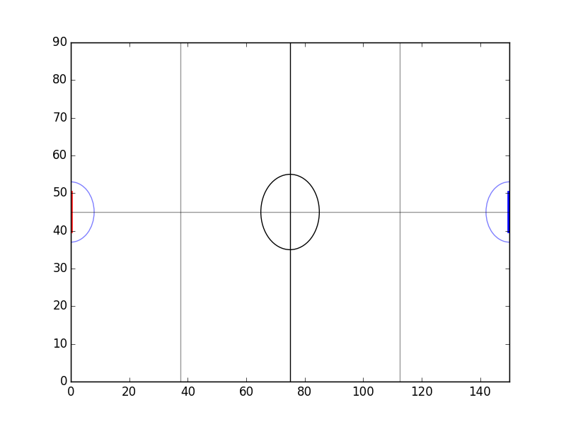

	# Writers introduction

README file to understand the content and aim of the project. Created and
edited by Cherfi Farouck and Hoffmann Yann from the UPMC - Sorbonne university
Paris VI 2018. Original code in french.

The main goal of this python code is to engineer different football strategy
IA on the basis of interdevelopment blablabla...

Testing *functionalities*

---------

Le principal object de ce code ecrit en python est blabla

Testing markdown.md

probleme de **import** et d**indentation** a *regler*
# Header 1 type of text
## Header 2 type

* List of basic stuff
	* Go to the toilet
	* Eat food
	* Remember to brush your teeth

* List of non basic stuff
	* Do sport
	* See the sunlight

Interesting part, this is a mapping of the original soccer field:


Kanye West:
>Were living the future so
>the present is our past
Somewhat poetic no that much of a douchebag after all maybe

What does this think do `<code>` second test `ok i get it`


```
MetaState(state):
	super()
	
	def __getattribute__(self, attr):
		if attr not in liste_methode:
			self.__getattr__(self, attr)

	def __getattr__(self, attr):
		print("Grossiere erreur que de se tromper de methode")
		sys.exit()
```

- [x] @CherfiFarouck, #refs, [links](), **formatting**, and <del>tags</del> supported
- [x] list syntax required (any unordered or ordered list supported)
- [x] this is a complete item
- [ ] this is an incomplete item

genre ca marche

mdr | kek
--- | ---
euh daccord | pourquoi pas

en fait cesst le fait github
:smile:
:heart_eyes:


Link to our [website](http://www.cowsay.com)

